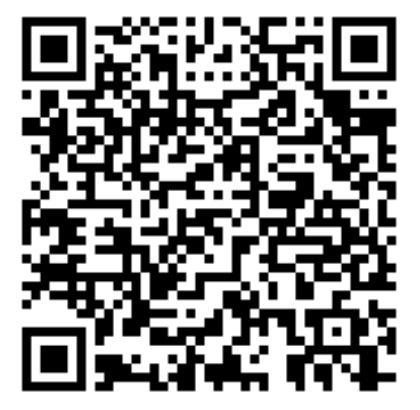

# Lecture: General Physics I
* Time: (2023 September 06 - December 20) 234節, Wednesday
* Lecturer: [Hauyu Baobab Liu](https://baobabyoo.github.io/) (呂浩宇)
* Location: NSYSU, 理 SC0009
* Language: 中文

### TA
- 葉皓翔 (j93939343@yahoo.com.tw)

### 學習輔導角落助教
- 洪懌平
  
### Office Hours (理SC2006-3)
- Location: **理SC2006-3**
- Time periods: Wed. 12:00-14:00; Thur. 10:00-12:00

## 其它規定:
辦公室環境密閉通風不良。為免辦公室內同學受傳染病影響，未戴口罩不得進入我辦公室。有呼吸道症狀者一律不準進入我辦公室。

### Homework and Suggested Problem Sets:

## Syllabus:
1.	測量、向量、運動 (measurements, vectors, motions; ch. 1-4; 9/06)
    - 建議做習題 (應至少看過一遍題目，確定自己會做): [chapter 3: 6, 7, 18, 26, 29, 32, 38, 39, 41; chapter 4: 7, 9, 20, 23, 32, 40, 43, 56, 67 ] [measurements_vectors_motions](https://github.com/baobabyoo/Lecture_GeneralPhysicsII_2023Sep_ChemDept/blob/main/lecture_notes/measurements_vectors_motions.pdf)
2.	力、運動、動能與功 (force, motion, work; ch. 5-7; 9/13) 建議做習題 (應至少看過一遍題目，確定自己會做): [chapter 5: 7, 13, 28, 30, 48, 49; chapter 6: 3, 11, 16, 19, 39, 44, 45; chapter 7: 1, 14, 24] [force_motion_work](https://github.com/baobabyoo/Lecture_GeneralPhysicsII_2023Sep_ChemDept/blob/main/lecture_notes/force_motion_work.pdf)
3.	位能與能量守恆 (energy conservation; ch. 8; 9/20) 建議做習題 (應至少看過一遍題目，確定自己會做): [chapter 8: 2, 10, 17, 21, 26, 34, 51][potential_energy_Econservation](https://github.com/baobabyoo/Lecture_GeneralPhysicsII_2023Sep_ChemDept/blob/main/lecture_notes/PotentialEnergy_Econservation.pdf)
4.	質心與動量 (center of mass and momentum; ch. 9; 9/27) 建議做習題 (應至少看過一遍題目，確定自己會做): [chapter 9: 1, 2, 5, 6, 7, 12, 13, 19, 26, 30, 42, 53, 59 (及閱讀課本chapter 9-9)] [center_of_mass_and_LinearMomentum](https://github.com/baobabyoo/Lecture_GeneralPhysicsII_2023Sep_ChemDept/blob/main/lecture_notes/com_momentum.pdf)
5.	轉動 (rotation; ch. 10; 10/4) 建議做習題 (應至少看過一遍題目，確定自己會做): [chapter 10: 4, 9, 10 (列式就好), 11 (列式就好), 13, 14, 17, 18, 20, 27, 50] [rotation](https://github.com/baobabyoo/Lecture_GeneralPhysicsII_2023Sep_ChemDept/blob/main/lecture_notes/rotation.pdf)
6.	力矩與角動量 (torque and angular momentum; ch. 11; 10//11) 建議做習題 (應至少看過一遍題目，確定自己會做): [chapter 11: 1, 6, 7, 8, 9, 17, 22, 46, 52] [Angular Momentum](https://github.com/baobabyoo/Lecture_GeneralPhysicsII_2023Sep_ChemDept/blob/main/lecture_notes/angular_momentum.pdf)
7.	重力 (gravitation; ch .13; 10/18) 建議做習題 (應至少看過一遍題目，確定自己會做): [chapter 13: 10, 11, 14, 15, 21, 48] [Gravitation](https://github.com/baobabyoo/Lecture_GeneralPhysicsII_2023Sep_ChemDept/blob/main/lecture_notes/gravitation.pdf)
8.	期中考 (10/25)
9.	平衡、彈性、流體 (elasticity, fluid; ch. 12, 14; 11/01) [Equilibrium and Elasticity](https://github.com/baobabyoo/Lecture_GeneralPhysicsII_2023Sep_ChemDept/blob/main/lecture_notes/equilibrium_elasticity.pdf) [Fluids](https://github.com/baobabyoo/Lecture_GeneralPhysicsII_2023Sep_ChemDept/blob/main/lecture_notes/fluids.pdf) 建議做習題 (應至少看過一遍題目，確定自己會做): [chapter 14: 1, 3, 7, 15, 31, 45, 54] **作業(Nov. 15上課時繳交，逾時不收) [chapter 14: 14, 34]** 
10.	諧震 (oscillations; ch. 15; 11/08)
11.	波動 I (waves I; ch. 16; 11/15)
12.	波動 II (waves II; ch. 17; 11/22)
13.	溫度、熱 (temperature, heat; ch. 18; 11/29)
14.	氣體運動理論 (kinetic theory of gas; ch. 19; 12/06)
15.	熵 (entropy, 2nd law of thermodynamics; ch. 20; 12/13) 
16.	期末考 (12/20)

## Goal:
1. Reviewing high-school physics.
2. Knowing basic thermal physics.
3. Allow taking my General Physics (II)

## Expectation:
1. This is a 3-credits' course. The expected weekly workload for you is 3 hours on average if you have no experience and knowledge in this area.

## Assessment:
- homework: 20%
- mid-term exam (written): 40%
- final exam (written): 40%
- You may fail if you do not learn well enough to take my General Physics (II)

## Suggested Textbooks:
1. Jearl Walker, David Halliday, Robert Resnick, Principles of Physics 11th Edition.

